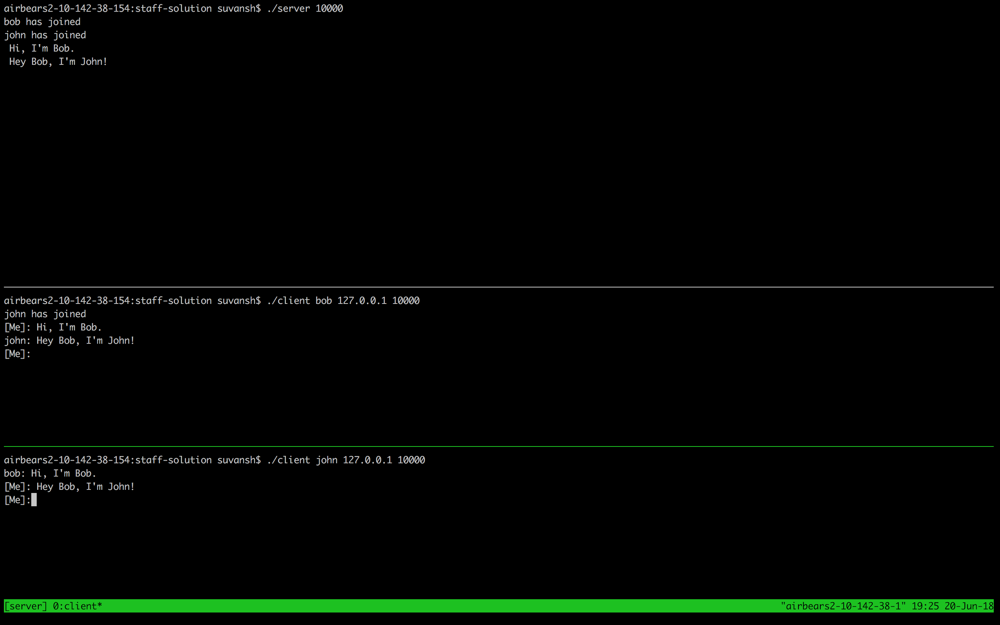
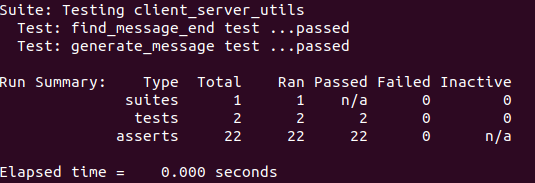
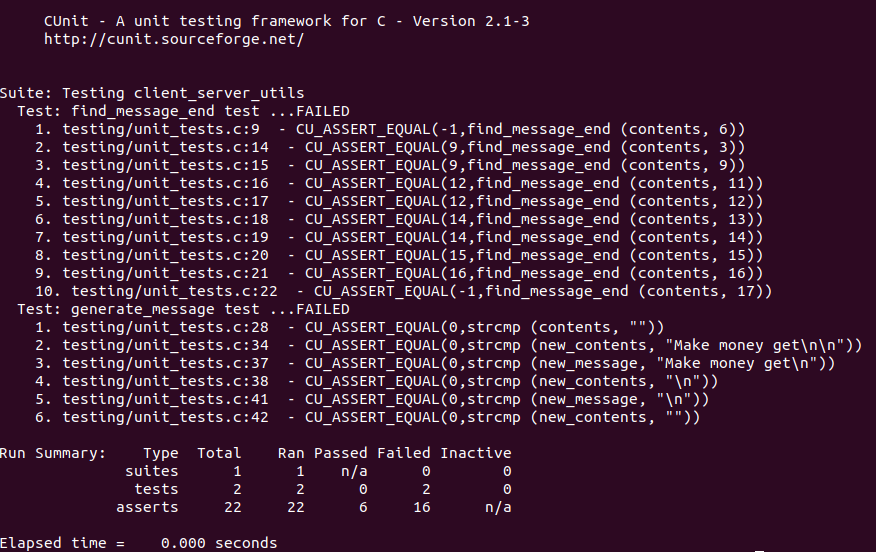
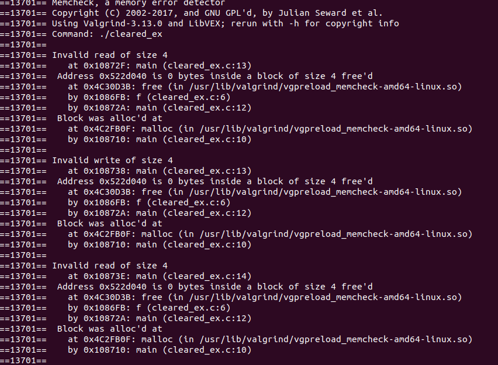

<<<<<<< HEAD
**Edit a file, create a new file, and clone from Bitbucket in under 2 minutes**

When you're done, you can delete the content in this README and update the file with details for others getting started with your repository.

*We recommend that you open this README in another tab as you perform the tasks below. You can [watch our video](https://youtu.be/0ocf7u76WSo) for a full demo of all the steps in this tutorial. Open the video in a new tab to avoid leaving Bitbucket.*

---

## Edit a file

You’ll start by editing this README file to learn how to edit a file in Bitbucket.

1. Click **Source** on the left side.
2. Click the README.md link from the list of files.
3. Click the **Edit** button.
4. Delete the following text: *Delete this line to make a change to the README from Bitbucket.*
5. After making your change, click **Commit** and then **Commit** again in the dialog. The commit page will open and you’ll see the change you just made.
6. Go back to the **Source** page.

---

## Create a file

Next, you’ll add a new file to this repository.

1. Click the **New file** button at the top of the **Source** page.
2. Give the file a filename of **contributors.txt**.
3. Enter your name in the empty file space.
4. Click **Commit** and then **Commit** again in the dialog.
5. Go back to the **Source** page.

Before you move on, go ahead and explore the repository. You've already seen the **Source** page, but check out the **Commits**, **Branches**, and **Settings** pages.

---

## Clone a repository

Use these steps to clone from SourceTree, our client for using the repository command-line free. Cloning allows you to work on your files locally. If you don't yet have SourceTree, [download and install first](https://www.sourcetreeapp.com/). If you prefer to clone from the command line, see [Clone a repository](https://confluence.atlassian.com/x/4whODQ).

1. You’ll see the clone button under the **Source** heading. Click that button.
2. Now click **Check out in SourceTree**. You may need to create a SourceTree account or log in.
3. When you see the **Clone New** dialog in SourceTree, update the destination path and name if you’d like to and then click **Clone**.
4. Open the directory you just created to see your repository’s files.

Now that you're more familiar with your Bitbucket repository, go ahead and add a new file locally. You can [push your change back to Bitbucket with SourceTree](https://confluence.atlassian.com/x/iqyBMg), or you can [add, commit,](https://confluence.atlassian.com/x/8QhODQ) and [push from the command line](https://confluence.atlassian.com/x/NQ0zDQ).
=======
# 61C Chatroom

## By Nick Riasanovsky
### Project TA: Suvansh Sanjeev

## Updates

This section will contain any updates to the Spec/Project since its release. To obtain these updates run the command:

```git pull proj1-starter master```

If you pull the starter code after the time of the update you will not need to pull the starter code to get the updates. Please follow the setup instructions to get started.

Changes since release:

  * Friday June 22nd 11:25 AM: Updated Makefile to change how the CUnit Library is linked. This lets CUnit be run on the hive machines.

  * Friday June 22nd 2:19 PM: Updated Makefile to change flags for CUnit tests so that cgdb can be run on the executable.

  * Monday June 25th 3:45 AM: Updated starter code with a working quicksort (will require repulling starter code for show_all_statuses to work). Made changes to comments on functions students will edit.

  * Monday June 25th 10:47 AM: Updated starter code to fix an issue with not freeing two pointers that were reachable. **YOU NEED TO UPDATE THE STARTER CODE FOR THIS.**

  * Monday June 25th 4:35 PM: Updated server.c and client.c starter code to fix an issue with not resetting the offset. This allows for a more general representation of find_message_end. **YOU NEED TO UPDATE THE STARTER CODE FOR THIS**

  * Tuesday June 26th 4:05 PM: Testing Framework released with a few sample tests. This resulted in a small change to ```server.c```, an major update to the Makefile, and a major update the to testing folder. **YOU NEED TO UPDATE THE STARTER CODE FOR THIS**

## Summary
This project is to construct a simple chatroom in C. It consists of two main parts: a server and a client both built in C. The communication is implemented via TCP sockets using the C socket interface. This is already implemented for you and is not the focus of this project (these are covered in both cs 168 and cs 162). Instead the focus of this project will be interacting with C strings, interacting with files, dealing with C memory management, interacting with the C standard library, and completing something relatively cool. To do this you will need to make modifications to both the client and the server.

## Background

Despite the goals of this project being oriented around familiarity working with C it is also necessary to understand how the server and client work. Additionally it may be helpful to explain how the existing starter code works. If these portions outside the course interest you, feel free to read about them. However they will be marked OPTIONAL as they are not necessary to complete the project.

### Sockets OPTIONAL

Sockets are an abstraction for sending information between two processes. In this model a socket can be thought of as a queue where messages are sent by one user and then received by another user. In this way we can communicate between programs, between computers, or even across the world. In particular we will communicate using the client and server model. In this model a single server exists at a recognizable address and clients connect to this server. Connection is done using a protocol, in our case TCP (which you can learn more about in cs 161, cs 162, or cs 168). The key properties of TCP are that they produce in order, reliable communication. Additionally we will be communicating over IPv4, the IP address with which you are probably familiar. Conceptually TCP and IP can be thought of as together providing the means to specify where to send data. The IP address provides a location to send the data and TCP provides a port which can be tied to a particular process (you can think of this as being similar to specifying your address as the IP address and your apartment number as the port).

### Interfacing with Sockets OPTIONAL

What makes sockets so useful of an abstraction is that we can treat them exactly like files, well lower level files. A socket's information in c is stored as a file descriptor (which is an integer). A file descriptor is just any integer that is used to describe a particular file. As a result there are two primary functions the start codes uses to interact with sockets. The first is:

`ssize_t read (int fd, void *buf, size_t count)`

Which takes in a file descriptor you want to read from, a location to place the data, and the number of bytes you want to read and returns the number of bytes successfully read while placing the data read in `buf` (it returns 0 if the connection closes).

The second function you will need is:

`ssize_t write (int fd, void *buf, size_t count)`

which works similarly to read except it writes data from `buf`. If you are interested in learning more about either function you can type **man 2 read** or **man 2 write** into your linux terminal for a full description. Additionally for man C functions the command **man SOME\_NUMBER FUNCTION\_NAME** can be used to get information about that function from terminal. The number that needs to specified depends on how many linux manuals exist under that name.

### Server
When launching a server it is necessary to have a known ip address and port for clients to connect to. To accomplish this you will use your own machine to host the server and will also run your clients on the same machine. For grading purposes we will do the same thing on a hive machine. The server will run on your localhost (IP address 127.0.0.1) on a port of your specification (you should pick a port between 10000 and 60000, since most lower numbered ports are already allocated) and handle communication from all clients.
You can run the server as follows.
```
./server 10000
```

If you try to run the server immediately after disconnecting it you may receive a message that says:

**Unable to create server socket**

This simply means the port is not yet available for use and you should choose another port. When we grade your project we will avoid this by choosing a random port from among 50,000.


### Client
The client will connect to the server and have to be on the same port as the server. Run the client as follows.
```
./client NAME 127.0.0.1 10000
```
Your client will exit immediately if there is no server running at that port or address.

### Putting it together
Using three separate terminal windows, run the following commands, in this order.
Terminal 1 (Server):
```
make build
./server 10000
```
Terminal 2 (Client 1):
```
./client NAME1 127.0.0.1 10000
```
Terminal 3 (Client 2):
```
./client NAME2 127.0.0.1 10000
```
`make build` only needs to be run once, so we run it in the server window, the first to be used.

## Behavior

The first step to hosting the chatroom is to start up a server and begin having clients connect to it. Once a client connects to the server it will immediately send the NAME terminated by a newline. This will cause the server to print

\"NAME has joined\"

Every message in this project output by either the server or the client will be terminated by a newline, including those print by the server. This is necessary because Sockets are simply streams of bytes so some character needs to be sent to denote the end of a message. We will be using the \'\\n\' to do this, so all messages must end in a newline. Additionally, for the purposes of this project you can assume that all tests will involved unique names. You can also assume that all names will have the following specifications:

  * All names consist of at least one character where each character is from the set of characters \[A-Za-z0-9\_\]

  * All names have a maximum length of 251

Now that the client is connected to the server it will send messages to the server. There are two types of messages a client can send:

  1. A normal text message. This message should be printed by the server

  2. A command message (see the section below for a more complete description)/

For any message the server should first print out the message received. With a normal text message the server will then send it to all other users, unless a command alters this behavior by first appendingthe user's name and a \':\' to the front. To simplify the project we will set a limit on the maximum size of a message. The contents of a message will be set at a maximum of 771 characters. Additionally the first byte received from the server will always be an indication of the type of message received from the server and not part of the actual message. These options are:

  1. A message to exit.

  2. A normal message that the client should output.

As a result the total amount of memory that must be allocated for receiving messages from the server is 1025 bytes per client. You should also be careful not to output the leading byte that indicates the type of message. The server and client should also gracefully handle disconnects from either side. The server should notify other clients if a client disconnects and if the server disconnects a client should output that the server has disconnected and exit.

Much of this behavior is already implemented for you and is merely intended to clarify functionality.

## Setup
To get starter code for this project, we will be using git.

First, you need to create a private repo with the format proj1-xxx, where xxx is your login. The process for this is very similar to what was done in lab. Please make sure this repo is NOT your work repo however. Furthermore, please set this to PRIVATE. Just to make sure, set this to PRIVATE. Before continuing, make sure your repo is PRIVATE. Not setting your repo to PRIVATE, even if by mistake, will be seen as an intention to cheat.
From your access management settings, give 'cs61c-staff' admin access to your repo. You also must do this from the very beginning to avoid any penalties placed upon your grade.
Did you set your repo to PRIVATE and give the 'cs61c-staff' admin access? If yes, enter into the directory of your class account that you would like to hold your proj1-xxx repository. Once in this directory, run the following:
```
git clone https://<mybitbucketusername>@bitbucket.org/<mybitbucketusername>/proj1-xxx.git
cd proj1-xxx
git remote add proj1-starter https://github.com/61c-teach/su18-proj1-starter.git
git fetch proj1-starter
git merge proj1-starter/master -m "merge proj1 skeleton code"
```
Once you complete these steps, you will have the proj1 directory inside of your repository, which contains the files you need to begin working.

As you develop your code, you should make commits in your git repo and push them as you see fit.

## File Descriptions
There are many files that exist for this project (a total of 9 c files). You will **NOT** need to edit all of these files and hopefully you will not need to read all of them to complete the project. This section is meant to give an overview of what each particular file is meant for and what you will need to change. All functions have more detailed descriptions in the code.

### Files you **WILL** edit

These are the only files you may edit and turn in. They are grouped together by different c concepts of increasing difficulty.

#### Strings and I/O

  *  ```client_server_utils.c```
    * This file contains functions that will be shared across the server and the client. You should complete this **FIRST**.
    * Functions you will edit:
      * `find_message_end` - This function will be used to find the index of the newline character which terminates a message.
      * `generate_message` - This function will be used to extract a message from our data buffer as a proper string so it can be utilized. It should also place any remaining data in the buffer to the front of the buffer or if none remains set the buffer to the empty string.


At this point you should pass all of the unit tests provided (see the testing section for more information).

  * ```student_client.c```
    * This file contains client code that you will edit. You should complete this **SECOND**.
    * Functions you will edit:
      *  `process_input` - This function will be responsible that the client properly reads from stdin.
      *  `handle_server_message` - This function is responsible for producing the correct output based on the type of message received from the server. This is either printing the message contents or exiting.


At this point you should be able to interact with your servering using a single client. More specifically you should be able to connect to the server and send messages to the server which they will output. You should then be able to read in another message. You will **NOT** yet be able to connect multiple clients without it crashing.

#### Structs, Pointers, and Memory

  * ```user_utils.c```
    * This file contains functions that contain information about each user that connects to the server. This is where you will get to work with structs and memory allocation. You should complete this portion **THIRD**.
    * You should work on the these functions at this point:
      * ```create_name```
      * ```create_name_info```
      * ```create_user```
      * ```has_nickname```
      * ```is_taken_nickname```
      * ```ismuted```
    * Be sure and look at `user_utils.h` to see the name_info and user_info struct definitions.

At this point your server should be able to connect and send messages across multiple clients. The server should function correctly except the commands. Here is an example of what this will look like:

-
-


  * ```commands.c```
    * This file contains functions that will be used to handle command behavior. The commands are described below in the commands sections.
    * You will be responsible for error checks, functionality, and ensuring that all memory is properly freed. You should **NOT** need to modify the messages being sent. If you implemented the rest of the function correctly the messages sent should be correct. This should be completed **FOURTH**.
    * The commands that you will need to modify functionality for will be:
      * set\_nickname
      * clear\_nickname
      * rename
      * mute
      * unmute
      * show\_status


At this point your server and clients should be fully functional except that the server leaks memory. At this point we will return to ```user_utils.c```

  * ```user_utils.c```
    * You should complete the following functions:
      * ```cleanup_user``` - Is used when a user disconnects or when the server exits. It should free any memory that will no longer be needed.
      * ```cleanup_name_info``` - May be useful to implement cleanup_user. This should cleanup the memory of any name_info struct that will no longer be needed.

At this point your server and clients should be complete.

### Files you **WILL NOT** edit

There are many other c files you will not edit. You may need to read some of these files, others you will not use. The goal is that when you need to a file external from the one your editing it will be clear. When working with files it is best practice to first read the .h files associated with these files and only check the .c files if it is necessary to observer the functionality in more detail. Ideally you would never need to check the contents of the .c files explicitly. The purposes of each of these files are:
  * ```client.c``` - Contains the code to setup the client socket and the main code the alternate between checking for a user message and receiving a message from the server.
  * ```client_utils.c``` - Contains useful functions for sending messages and displaying output.
  * ```server.c``` - Contains the main server functionality. It handles the server setup, maintenance of connections, and sending of messages.
  * ```server_utils.c``` - Contains functions helpful for interpretting and generating messages. These are used to implement utility for creating commands and can be used throughout the server when strings need to be concatenated.
  * ```command_utils.c``` - Contains functions that are useful in implementing commands.


### Command Messages

In addition to needing to support regular messages it will also be necessary to support handling command messages. All command message begin with a "\\" after possibly some leading whitespace. There are 8 command messages that must be supported with their arguments shown beside them:

  * **exit**

  * **server\_exit**

  * **set\_nickname \<NAME\> \<NICKNAME\>**

  * **clear\_nickname \<NAME\>**

  * **rename \<NEWNAME\>**

  * **mute \<NAME\>**

  * **unmute \<NAME\>**

  * **show\_status \<NAME\>**

  * **show\_all\_statuses**

Command message parsing will work as follows. There will be no parsing done at the client level. All processing will be done by the server (and is already implemented for you). Upon determining a command message exists the server will then decide how to proceed. If the command message is to be handled at the server level then the server will perform the necessary action internally. Otherwise if it needs to be handled by the client then a message will be sent to the client with the indication that it is a command message. Then the client will take the necessary action. You are responsible for ensuring that the correct action occurs for each command message by filling out the appropriate `handle_COMMANDMESSAGE` function according to their specifications.

White the output message listed below will not show a \'\\n\' character every message ends in a newline. Additionally all output messages should be properly written if you implement the correct actions for the each function. As a result you should worry simply about functionality and handling errors and not worry about the formatting of the messages.

Note that for simplicity each command message is case sensitive.

#### **exit**

The exit command message is the only client handling command message. This will be done using an indication from the leading byte on a message a client recieves from the server (see the enum in `client_server_utils.h`) When this message is recieved the client should close the socket connection and exit with a success flag (exit code 0). To do this YOU MUST USE the `close` function to close the sockets, and then exit. This will be used for testing purposes to ensure the socket connection is properly closed. In addition the client being closed must output the message:

"You have left"

before exiting. The server should then send every other user

"USER has left"

### **server\_exit**

The server\_exit command is handled in the server. It takes no arguments. It prompts the server to free all existing memory and exit. It is primarly implemented for testing purposes so we can ensure there are no memory leaks. It has already been implemented for you.

#### **set\_nickname NAME NICKNAME**

This command message is handled in the server. It takes exactly two arguments, the actual name of the user whose nickname should be set and the nickname to set. The requirements for a nickname are:

  * Argument 1 must be a valid name (see the name requirements above) and  must be unique among all actual names and existing nicknames including the person who is having their nickname altered. Both of these features are encapsulated by the function `isvalidname`

If the nickname meets all the requirements for a name then all users except the one who set the nickname should receive a message that says:

"USER set NAME's nickname to NICKNAME"

Where USER is the actual name of the client who set the nickname. The user should receive a message from the server that says either:

"You set NAME's nickname to NICKNAME"

or

"You set your nickname to NICKNAME"

depending on if USER is set their own nickname.

Then all future messages sent from NAME should have NICKNAME as the sender used by the server instead of NAME.

#### **clear\_nickname NAME**

This command message is handled in the server. It takes one argument, the actual name and removes NAME's nickname, replacing it with NAME's name. If the NAME meets all the requirements for name then all users except the one who set the nickname should receive a message that says:

"USER has cleared NAME's nickname"

The USER should either output:

"You have cleared NAME's nickname"

or

"You have cleared your nickname"

depending on if the the USER cleared their own nickname. Now all messages sent should use the NAME rather than any nickname. A nickname can be cleared even if a user does not have a nickname.

#### **rename NAME**

This command is handled in the server. It takes one argument, a name that a USER wants to change their name to. The NAME must not be a user's current name or nickname, including the user trying to rename. If the NAME meets all the requirements then all users excepted the one changing their name should receive a message that says:

"USER changed their name to NAME"

and the user should receive a message that says

"You have changed your name to NAME"

Now all commands that refer to this USER must use the new name and not the old one.

#### **mute NAME**

This command is handled in the server. It takes one argument, a name that a USER wishes to mute. The name must be an actual name of a user and cannot be the user issuing the command's name. If the NAME meets all the requirements then the USER should receive message:

"User NAME is now muted"

regardless of if NAME is currently muted. The server now should not send that User any message from NAME (but it should still output the result of any of NAME's control messages).

#### **unmute NAME**

This command is handled in the server. It takes one argument, a name that a USER wishes to unmute. This name must be an actual name of a user and cannot be the user issuing the command's name. If the NAME meets all the requirements then the USER should receive message:

"User NAME is no longer muted"

regardless of if NAME is currently muted. The USER should now receive NAME's messages as normal.

#### **show\_status NAME**

This command is handled in the server. It takes exactly one argument, the actual name of a user, including possibly the USER who issued the command. The server should then send only the user messages. If the name meets the requirements then USER should receive 3 messages from the server.

The first is

"User NAME"

The second is an indication of whether or not the user has a nickname and if so what it is. This message should either be

"Nickname NICKNAME"

or

"User has no nickname"

and finally the last message should either be

"User is muted"

or

"User is not muted"

If the a client calls show\_status on theirself then the server should output they are not muted.

#### **show\_all\_statuses**

This command is handled in the server. It takes no arguments and should output for the USER the result of calling show\_status on each user's name in alphabetical order.

#### **unknown command message**

If a message is sent beginning with a "\\" and followed by a nonwhitespace character then this message should always be interpretted as a command. If the message following the "\\" is not one of the 8 listed then the user who sent it should receive a message that says:

"Unknown command COMMAND"

#### **incorrect arguments**

If any command is called with arguments that do meet the specifications for that command, then the USER should be given the message:

"Incorrect arguments for COMMAND command"

where COMMAND is the name of the command, and no other user should receive a message.

## Testing and Debugging

Testing this project can and should be done using multiple platforms to ensure correctness. We will discuss a few here that we recommend. 

### CUnit

The first way that we will be having you test your code is with CUnit, which is unit tests for C. To run CUnit you will need to be on the hive machine (or a machine with CUnit installed). This will only be used to produce tests for the functions in `client_server_utils.c` (in fact it is the only section you can unit test because of the file dependencies).

To run the CUnit tests type the command

```make unit-test```

into terminal in the main directory (the one with the makefile). This will compile and run the tests. 

If you pass all the CUnit tests you will get output that looks like this:


Whereas if you fail the CUnit tests you will get output that will look something like:


### cgdb

cgdb is a very useful tool to debug programs. It is covered in detail in Lab 1 so if you are not familiar with cgdb please complete Lab 1. This section is meant to explain how to use it in this project. We can use it for two purposes:
  * Debugging the Unit Tests
  * Debugging Server bugs (after the Second portion is complete).

#### Debugging Unit Tests

We will assume that you have first run ```make unit-test``` in terminal. Then to use cgdb on the unit tests use the command
```cgdb testing/unit_tests```
and proceed through cgdb

#### Debugging the Server

Debugging the server is a bit more complicated. First we will need to have existing executables so we will run the command

```make build```

Then we will need to setup the server which we want to debug so we will open cgdb on it using the command

```cgdb server```

This opens cgdb. We can now establish any breakpoints as normal but if we want to debug we need to the code with a port. For example we might do

```r 12345```

You might at this point discovered that nothing has happened. This is because for the server to execute code of the nature that you will be debugging you need to have at least 1 other terminal open with a client connected. For you example you might have one terminal that runs
```./client Nick 127.0.0.1 12345```
and another that runs
```./client Steven 127.0.0.1 12345```

Now you can send messages as normal from the client debug them in the server. If you have set breakpoints you will be able to take control from the debugger once you have received a message that sends you to that line of code.

If you segfault you can run ```bt``` in cgdb to get a backtrace of relevant information.

One final important note is that if you want to run the server multiple times in a row in the debugger you want to use different ports as otherwise your server may exit successfully.

### Valgrind

Additionally, you will want to check your project for memory leaks! To do this, you will use a program called valgrind, which is already installed on the hive machines. Usage is as follows
```
valgrind --leak-check=full ./server 10000
```
And in a separate terminal window,
```
valgrind --leak-check=full ./client NAME 127.0.0.1 10000
```
Use the program as normal. Once terminated, valgrind will display a summary of memory usage and inform you of any memory leaks.

Additionally, valgrind can be used to idenfity memory access errors as well. Here is an example of error outputs from a different program when a variable that had been freed was accessed afterwards.

-

Notice that valgrind can tell you where the malloc was made, where the free was made, and where the illict access occurred. Although its not perfect and may not find every time you access illegal memory it can be an essential tool.

### Testing by Hand

A good portion of this project should be tested by hand (after all whats the point of making a chatroom to interact with if you never interact with it). As a result you follow the above steps to run both programs and play around with it. You will likely want to enumerate what you have tested so you can later turn them into autograder tests.

### Autograder Testing

The autograding portion will consist of you writing tests in what we hope is an easy format. This framework will then run your code automatically. This consists of a series of C and Python processes working together and is beyond the scope of this course. Closer to the deadline we plan to release an additional file which will assess the coverage of your testing suite. The tests you write **WILL NOT** be grading but your coverage should be a useful indicator for how you expect your code to perform on our autograder.

#### Changes to the server

In order to support the autograder the server now outputs:

"Server messages:"

upon starting up. This allows for synchronization across the many processes that compose the autograder.

#### Warning

This testing framework is constructed to run on the hive machines only. It is not guarenteed to work on your own computer and the staff will not take the time to debug it. The setup instructions are only supplied for working on the hive.

#### Setup

To get the testing framework functional will only require two steps. First you will need to have the most up to date version of the starter code. As a reminder this is done with the command:

```git pull proj1-starter master```

Next you will need to install a python package on the hive machine. This can be done using the command:

```python2.7 -m pip install psutil```

Once these two commands are complete you should be able to follow the instructions below the write your own tests and test your code.

#### Writing Tests

To write a test you will create a file and produce a chat log between the members. For example here is the contents of basic.txt, which is provided for you.

```
Nick: Hi
Steven: Hi
Steven: This is a test
Nick: I hope we pass

```
That's it. All you have to do is write files whose contents consist of users sending messages back and forth and the testing framework will automatically produce input files, expected outputs, and run your implementation to produce the actual outputs. There are a few rules about tests:

  * Each name to the left of the colon is the name of a user. Each occurance of a name is the same user speaking.

  * All users will connect before any messages are sent. This is done deterministically to ensure consistent output.

  * If a user is renamed the original name should still always be the name to the left of the colon.

  * There are a maximum of 10 unique users and the names must adhere to the rules in the spec.

  * A user can leave anytime using the \exit command and the entire program can end using the \server_exit command.

You will write files by placing the contents in either **testing/tests/functionality** or **testing/tests/memory**. **YOU MAY ONLY PLACE FILES AND NOT DIRECTORIES. IF YOU PLACE DIRECTORIES THEY WILL BE DELETED AS PART OF THE TEST RUNNING PROCESS.** Placing in either of these two folders has almost the same effect except placing in memory also runs the server in valgrind. This means that the code will be about 40 times slower, so you should only place files in the memory directory that are specific cases for possible memory leaks.

Additionally if you place a file in the memory directory then it must either have at least one user still connected at the end of the message streams or have the server_exit before everyone leaves.

#### Running your whole Testing Suite

To run your whole testing suite use the command:

```make run-testing```

from your directory that contains the makefile. Note that since this runs every test it may take a while. If you decide you don't want to wait for all tests to finish then you can user ctrl + c to interupt it. This is the only command you should use to interrupt it.

#### Running a single test

If you want to run just a single test there are two different commands you can run depending on if the test you wish to run is in the functionality or memory directory. If your test is in the functionality directory then run the command:

```make run-correctness-test TEST_NAME=test```

in the directory with your makefile. For example to run the basic.txt test in the starter code you would type:

```make run-correctness-test TEST_NAME=basic.txt```

If instead you want to run the memory tests you would run

```make run-mem-test TEST_NAME=test```

So for example to run the basic.txt test that is in the memory direct or you would type

```make run-mem-test TEST_NAME=basic.txt```

#### Debugging Output

The output for running a test is stored in the testing/tests/[Functionality or Memory] directory. For each test you will find 3 directory: the name with _inputs appended, the name with _outputs appended, and the name with _refs appended. Your output is stored in _outputs and the expected outputs is stored in _refs (along with the valgrind log). A diff will be produced when the suite completes telling you which files differ. You can use this to determine which tests you are failing and why. To actually debug these tests you run the details of the test by hand if you want to use cgdb. If the output appears completely correct when you do it by hand it is possible there is a bug in the framework and you should post on piazza.

#### Bugs

This framework is not perfect. Among the things that may need to be changed includes the amount of time to wait before it timesout. One bug you may experience is where server may be unable to start because it could not connect to the port selected. We are currently working on a fix but in the worst case we will check for this.

If you find other bugs please post about it on piazza for us to look at.

## Submission
There are two steps required to submit Project 1. Failure to perform both steps may result in a partial deduction.

First, you must submit using the standard unix `submit` program on the instructional servers. This assumes that you followed the earlier instructions and did all of your work inside of your git repository. To submit, follow these instructions after logging into your cs61c-xxx class account:
```
cd proj1-xxx
submit proj1
```
Once you type submit Project 1, follow the prompts generated by the submission system. It will tell you when your submission has been successful and you can confirm this by looking at the output of glookup -t. Remember, you only need to submit four files: `client_server_utils.c`, `student_client.c`, `user_utils.c`, and `commands.c`.
Additionally, you must submit Project 1 to your bitbucket repository. To do so, follow these instructions after logging into your cs61c-xxx class account:
```
cd proj1-xxx
git add -u # should add all modified files in proj1 directory
git commit -m "Project 1 submission"
git tag -f "proj1-sub" # The tag MUST be "proj1-sub". Failure to do so may result in loss of credit.
git push origin master --tags # Note the "--tags" at the end. This pushes tags to bitbucket
```

## Grading
The grading for this project will be done almost entirely by automated scripts. Your output must exactly match the specified format, which makes correctness the primary goal of this project. Again, you are to do this work individually.

One particular aspect of C is nondeterminism: something that may run perfectly fine on one computer doesn't run the same way on another due to memory bugs or other issues. We will be grading exclusively on the hive cluster, so you must make sure your code works correctly on those systems. And although we will attempt to help you run your code on your own computer rather than the hive, please understand that running on your own computer may result in problems we are not equipped to debug.

To test your project we will produce a testing framework which can autogenerate expected output and automate the running of your server and clients automatically. Test writing is essential to programming so for this reason we will not be offerring any autograding of your code before the deadline. However, we will also not explicitly grade you on the tests you will produce. Instead what we will do is closer to the deadline we will make test submission available (details on how to make the tests will be released with the framework). We will run a test-autograder which we will use to determine how many of the cases we will be testing you hit. For a portion of these tests we will display a limited amount of information about those you are missing (at most 3 at a time), but others we will keep details about internal (though if you write new tests that reach this you will receive an increased code coverage score). Again code coverage is not worth any actual course points but should help enstill confidence in the code you produced if run on the hive machine. To encourage everyone to get into a habit of testing we will allow you to discuss possible cases to consider but you **WILL NOT** be allowed to shared any actual test cases.
>>>>>>> proj1-starter/master
